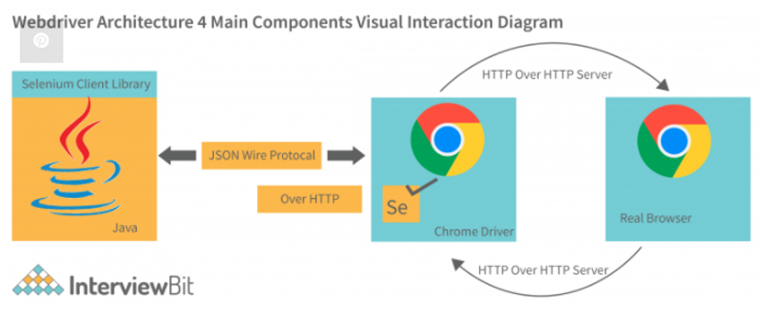

**1.	Explain Selenium architecture.**
**Ans.**

Selenium webdriver has the following units −

**Selenium Binding Languages/Selenium Client library** − Selenium can work on various libraries like Java, Python, Ruby, and so on. It has the language bindings for more than one language.

**JSON Wire Protocol over HTTP** − JSON is Javascript Object Notion. It is used for transferring data from the server to the client on the web page. It is based on the Rest API that transmits information among HTTP servers.

**Browser Driver** − All the browsers have a specific browser driver. They interact with the browsers (hiding the logic of browser functionality). As the browser driver receives a command, it is run on the browser and the status of the execution goes back in form of HTTP response.

**Browser** − Selenium can test applications on browsers like Firefox, Chrome, IE, and so on.

Reference: https://www.interviewbit.com/blog/selenium-architecture/

#2. Explain the code Webdriver driver = new Chromedriver(); / Internal working when this line is executed / How does the Selenium WebDriver work?
**Ans.**

Once we trigger our script for execution, the code is converted to an URL via the JSON Wire Protocol over HTTP. 
The URL will then be fed to the browser driver. 
The browser driver takes the help of HTTP server to get the HTTP request.
The browser driver then passes on the request to the actual browser via HTTP. 
Finally, the test script gets executed. If there is a POST request there will be action on the browser.
If there is a GET request, a response gets generated at the browser. 
It shall be passed via HTTP to the browser driver. 
Then the browser driver passes it to the IDE with the JSON Wire Protocol.

